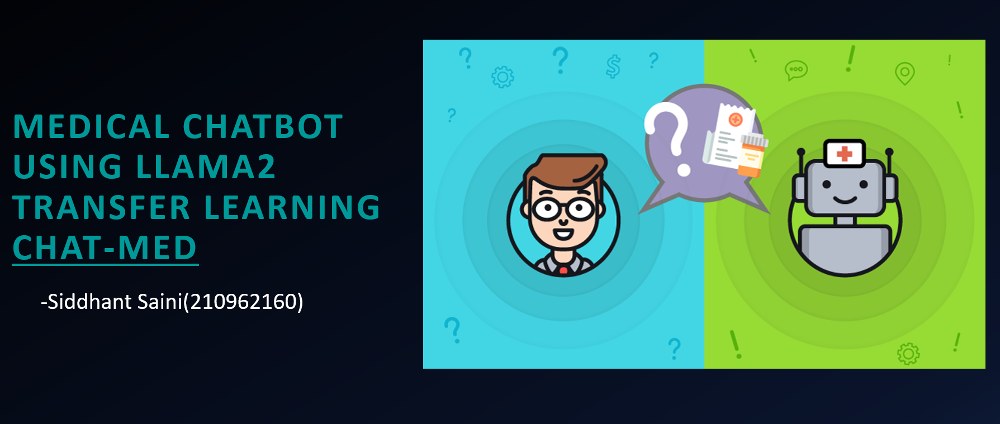
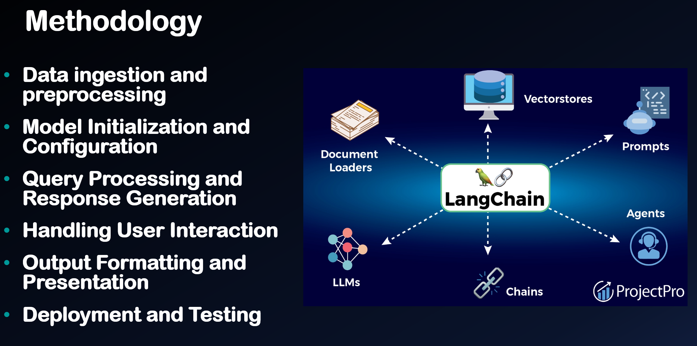
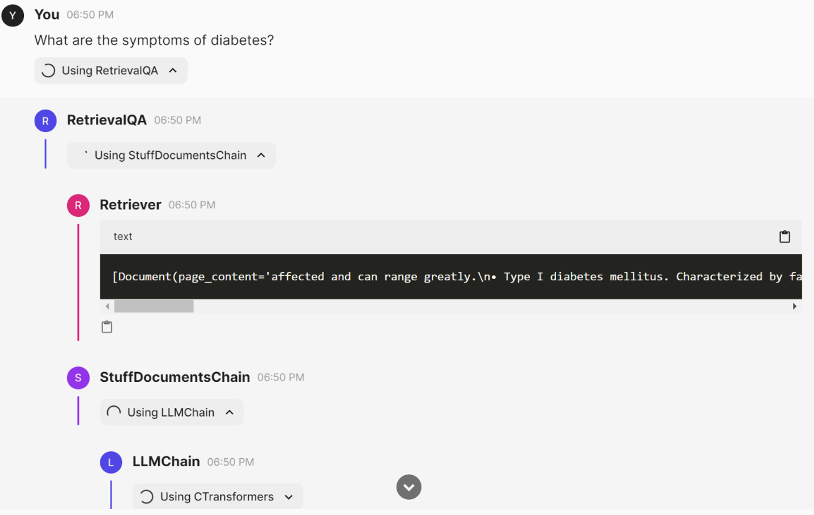
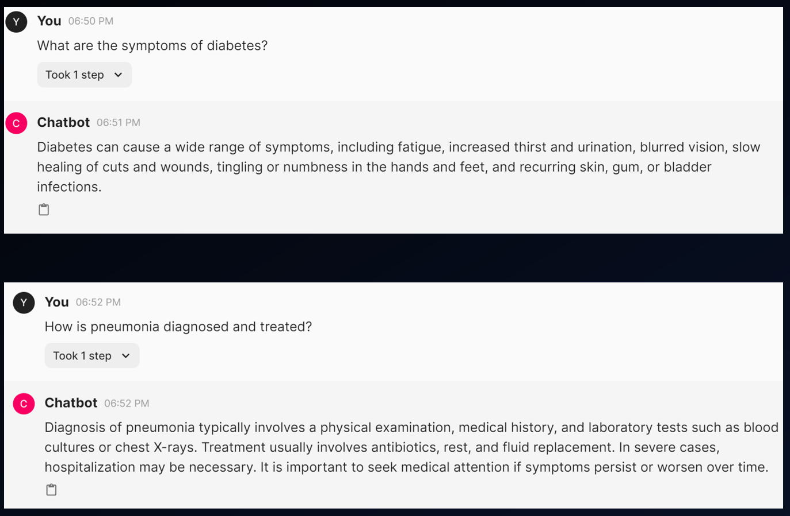

# Medical Chatbot using Llama 2



## Overview

This project presents **Chat-Med**, an **AI-powered Medical Chatbot** designed to provide real-time medical consultations. The chatbot is built using **Llama 2** and fine-tuned on a medical knowledge base using the **GALE Encyclopedia of Medicine**. It is capable of answering a wide range of medical queries by retrieving information and optionally citing the sources for the responses.

Chat-Med leverages state-of-the-art technologies such as **LangChain** for QA retrieval, **Faiss** for vector-based similarity searches, and **Chainlit** for user interaction.

---

## Features

- **Llama 2 Integration**: Utilizes Meta's Llama 2-7B model for enhanced natural language processing capabilities.
- **Medical Knowledge Base**: Trained on **GALE Encyclopedia of Medicine**, ensuring accurate and reliable responses.
- **Efficient Vector Database**: Uses **Faiss** to store and retrieve medical documents quickly.
- **Interactive User Interface**: Built with **Chainlit**, enabling a seamless question-and-answer experience.
- **Source Transparency**: Provides references from the knowledge base to ensure credibility.
### Llama 2 Model
  
---

## Project Architecture



1. **Data Ingestion and Preprocessing**: Medical PDFs are processed and split into manageable chunks using `PyPDFLoader` and `RecursiveCharacterTextSplitter`.
2. **Vector Database**: The text chunks are embedded using `HuggingFaceEmbeddings` and stored in **Faiss** for efficient retrieval.
3. **Language Model**: The **Llama 2-7B** model is used for generating the most accurate answers to medical queries.
4. **Question-Answer Chain**: The retrieval chain powered by LangChain fetches relevant information based on user queries.
### Chatbot Processing
   

---

## Setup and Installation

### Prerequisites

- Python 3.8 or higher
- PyTorch
- Llama 2 model (Llama-2-7B)
- LangChain
- Faiss
- Chainlit

### Installation Steps

1. **Clone the repository**

   ```bash
   git clone https://github.com/your-username/MedicalChatbot.git
   cd MedicalChatbot
   ```

2. **Create a virtual environment**

   ```bash
   python3 -m venv venv
   source venv/bin/activate
   ```

3. **Install the dependencies**

   Install all required libraries using the provided `requirements.txt` file.

   ```bash
   pip install -r requirements.txt
   ```

4. **Download the Llama-2-7B Model**

   Download and load the **Llama-2-7B model** into the project directory.

   ```bash
   # Place model in the specified folder
   ```

5. **Run the chatbot**

   You can run the chatbot using Chainlit with the following command:

   ```bash
   chainlit run ingest.py
   ```

---

## Usage

Once the chatbot is running, start interacting with it by asking questions related to medical conditions. The bot retrieves answers from the knowledge base and displays them along with the sources.

### Example Queries:

#### Query:  
```bash
What are the symptoms of diabetes?
```

**Response:**
```bash
Diabetes can cause a wide range of symptoms, including fatigue, increased thirst, frequent urination, and blurred vision. 
Sources: GALE Encyclopedia of Medicine, Volume 1
```

#### Query:  
```bash
How is pneumonia diagnosed and treated?
```

**Response:**
```bash
Pneumonia is diagnosed through physical exams, medical history, and lab tests. Treatment includes antibiotics, rest, and fluids.
```



---

## Files in the Repository

- **`ingest.py`**: Handles data ingestion and the creation of the vector database using Faiss.
- **`model.py`**: Defines and loads the Llama 2 model and sets up the retrieval chain.
- **`requirements.txt`**: Lists the required Python libraries for the project.
- **`chainlit.md`**: Chainlit configuration file.
- **`README.md`**: The documentation file you're reading.
- **`vectorstore/db_faiss/`**: Directory containing the FAISS vector store.
- **`data/`**: Contains the medical knowledge base PDF.

---

## Conclusion

The **Chat-Med** chatbot provides a robust AI-driven solution for answering medical queries, leveraging Llama 2 for language processing and Faiss for fast retrieval of relevant documents. By providing transparency through sourced information, the chatbot delivers credible and reliable answers.

---

## Future Work

- **Real-Time Interaction**: Investigating methods for real-time query handling and feedback.
- **Scalability**: Optimizing the system for larger datasets and faster response times.
- **Enhanced User Experience**: Introducing voice interaction and real-time updates.

---

## Acknowledgments

Special thanks to **Manipal Institute of Technology** for providing resources and support.
