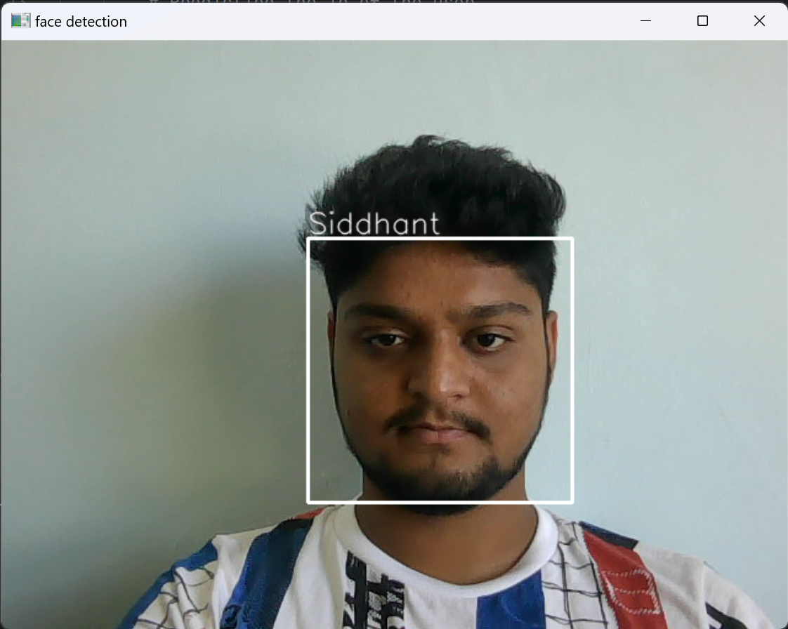
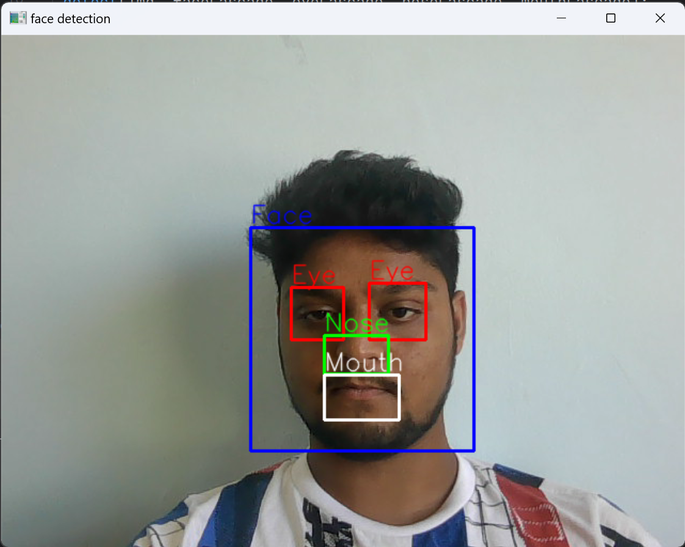
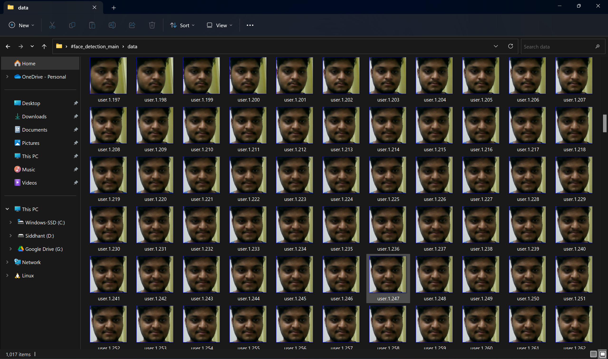
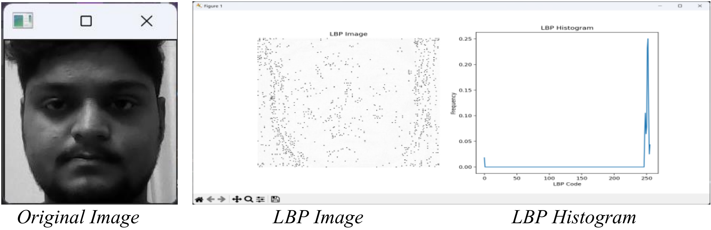
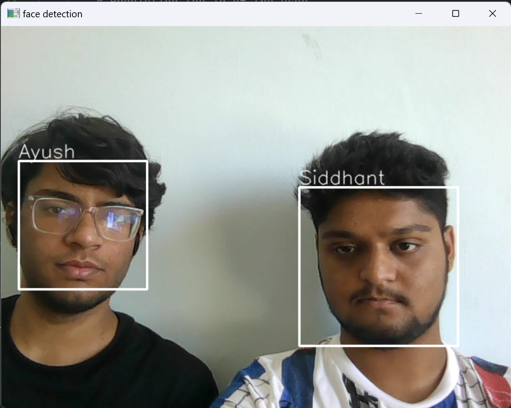

# Face Detection and Recognition System

## Table of Contents
- [Project Overview](#project-overview)
- [Features](#features)
- [Project Structure](#project-structure)
- [Installation](#installation)
- [Usage](#usage)
  - [Dataset Generation](#dataset-generation)
  - [Training the Model](#training-the-model)
  - [Real-Time Face Detection and Recognition](#real-time-face-detection-and-recognition)
- [Face Detection Details](#face-detection-details)
- [Face Recognition with LBPH](#face-recognition-with-lbph)
- [Screenshots and Visuals](#screenshots-and-visuals)
- [Experimental Results](#experimental-results)
- [Future Work](#future-work)
- [Acknowledgements](#acknowledgements)
- [References](#references)

---

## Project Overview

This project is a real-time **Face Detection and Recognition System** developed individually by **Siddhant Saini**. The system uses machine learning and computer vision techniques to detect faces in a webcam feed using **Haar Cascade Classifiers** and recognizes individuals based on a pre-trained **LBPH (Local Binary Pattern Histogram)** model. It also includes feature detection capabilities for eyes, nose, and mouth.

The system is designed for various real-time applications like:
- **Security and Surveillance**
- **Personalized User Experiences**
- **Biometric Authentication Systems**

Face recognition is performed by training the system on a dataset of user faces, which can be easily collected using the webcam. The trained model can then recognize users in real-time.

---

## Features

- **Real-Time Face Detection**: Detects human faces in real-time using the Haar Cascade Classifier.
- **Facial Feature Detection**: Detects specific features such as eyes, nose, and mouth.
- **Face Recognition**: Recognizes individuals using the LBPH algorithm.
- **Dataset Generation**: Automatically generates a dataset of images for training purposes.
- **Training Model**: Trains an LBPH model on the generated dataset.
- **Multiple User Support**: Can recognize multiple individuals in real-time.

---

## Project Structure

```plaintext
face_detection_main/
│
├── data/                              # Directory where training data is stored
│   └── (user face images are saved here)
├── haarcascade_frontalface_default.xml # Pre-trained model for face detection
├── haarcascade_eye.xml                 # Pre-trained model for eye detection
├── Mouth.xml                           # Pre-trained model for mouth detection
├── Nariz.xml                           # Pre-trained model for nose detection
│
├── attendance.py                       # Script to manage attendance system
├── classifier.py                       # Script to train the classifier using LBPH
├── dataset_train.py                    # Script to generate dataset
├── face_detection.py                   # Script to detect faces in real-time
├── lbphistogram.py                     # Script to create LBP histogram
├── main.py                             # Main entry point for face detection and recognition
├── webcam.py                           # Script to handle webcam operations
│
└── README.md                           # Project documentation
```

---

## Installation

1. **Clone the Repository**

   ```bash
   git clone https://github.com/yourusername/face_detection_recognition.git
   cd face_detection_recognition
   ```

2. **Install Required Libraries**

   Ensure you have the necessary Python libraries installed:

   ```bash
   pip install numpy opencv-python Pillow matplotlib scikit-image
   ```

3. **Download Pre-trained Classifiers**

   Download the required Haar Cascades from [OpenCV GitHub](https://github.com/opencv/opencv/tree/master/data/haarcascades).

   Ensure the following files are in the project directory:
   - `haarcascade_frontalface_default.xml`
   - `haarcascade_eye.xml`
   - `Mouth.xml`
   - `Nariz.xml`

---

## Usage

### Dataset Generation

To generate the dataset for training, use the `dataset_train.py` script. This script captures images from the webcam and stores them in the `data/` directory with unique IDs for each user.

```bash
python dataset_train.py
```

- It captures **500 images per user** to ensure diverse training data.
- The images are saved in the format: `data/user.<id>.<image_id>.jpg`

---

### Training the Model

Once the dataset is ready, you can train the LBPH face recognition model using the `classifier.py` script:

```bash
python classifier.py
```

This will create a `classifier.yml` file, which contains the trained model based on the dataset.

---

### Real-Time Face Detection and Recognition

To run the real-time face detection and recognition system, execute the `main.py` script:

```bash
python main.py
```

- The system will capture video from the webcam, detect faces, and recognize users.
- Press `q` to exit the program.

---

## Face Detection Details

The project uses **Haar Cascade Classifiers** for face and feature detection. Haar Cascades are lightweight and efficient, making them ideal for real-time applications.

### Face and Feature Detection

- **Face Detection**: The `haarcascade_frontalface_default.xml` file is used to detect faces in the webcam feed.
- **Eye Detection**: `haarcascade_eye.xml` detects the eyes of the user.
- **Nose Detection**: `Nariz.xml` detects the user's nose.
- **Mouth Detection**: `Mouth.xml` detects the mouth region.

## Face Recognition with LBPH

The **LBPH (Local Binary Pattern Histogram)** algorithm is used for recognizing faces. It works by extracting texture patterns from each face image and creating a histogram of these patterns. This histogram serves as a unique fingerprint for each face, making it possible to recognize individuals.

- **Training**: The classifier is trained on the images captured in the `data/` directory.
- **Recognition**: Real-time recognition is performed based on the model saved in `classifier.yml`.

---
#### Example of Face Recognition:
   

---

## Screenshots and Visuals

1. **Feature Detection (Eyes, Nose, Mouth)**:
   

2. **User Dataset Generation**:
   

3. **LBP Histogram and LBP Image**:
   

---

#### Example of Multi-Face Recognition:
   

---
## Experimental Results

During testing, the system demonstrated **high accuracy** in detecting and recognizing faces under good lighting conditions. The Haar Cascade Classifiers effectively detected facial features, and the LBPH model provided reliable recognition results.

### Key Findings:
- **Real-time Performance**: The system works efficiently with minimal lag.
- **Accuracy**: The recognition accuracy was high for well-lit images but reduced slightly in poor lighting conditions.
- **Scalability**: The system can easily be scaled to recognize more users by adding more training data.

---

## Future Work

There are several potential improvements that can be made to the system:

- **Deep Learning**: Integrate Convolutional Neural Networks (CNNs) to improve accuracy and handle complex scenarios like partial occlusion or low-light environments.
- **Lighting Conditions**: Implement pre-processing techniques to enhance face recognition in low-light conditions.
- **Mobile Support**: Extend the system to work on mobile devices using lightweight models.
- **Privacy Features**: Add encryption to protect personal data during the recognition process.

---

## Acknowledgements

I would like to extend my gratitude to the **OpenCV Community** for the libraries and documentation that made this project possible, and to the mentors at **Manipal Institute of Technology** for providing guidance and support throughout the development of this project.

---

## References

1. [OpenCV Documentation](https://docs.opencv.org/)
2. Viola, P. and Jones, M. J. "Rapid Object Detection using a Boosted Cascade of Simple Features." CVPR (2001).
3. Taigman, Y., et al. "DeepFace: Closing the gap to human-level performance in face verification." CVPR (2014).
4. Schroff, F., et al. "FaceNet: A unified embedding for face recognition and clustering." CVPR (2015).
