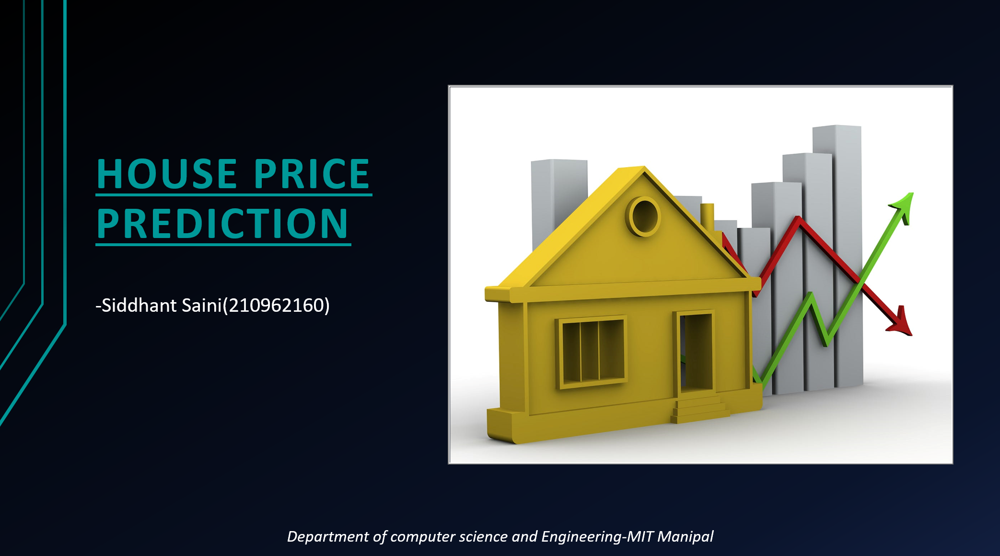
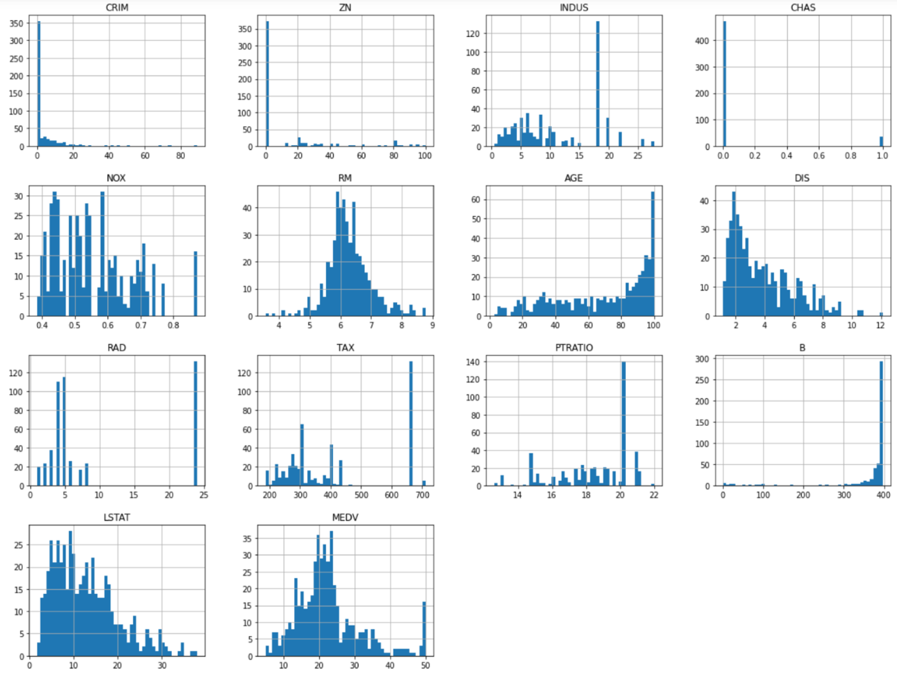
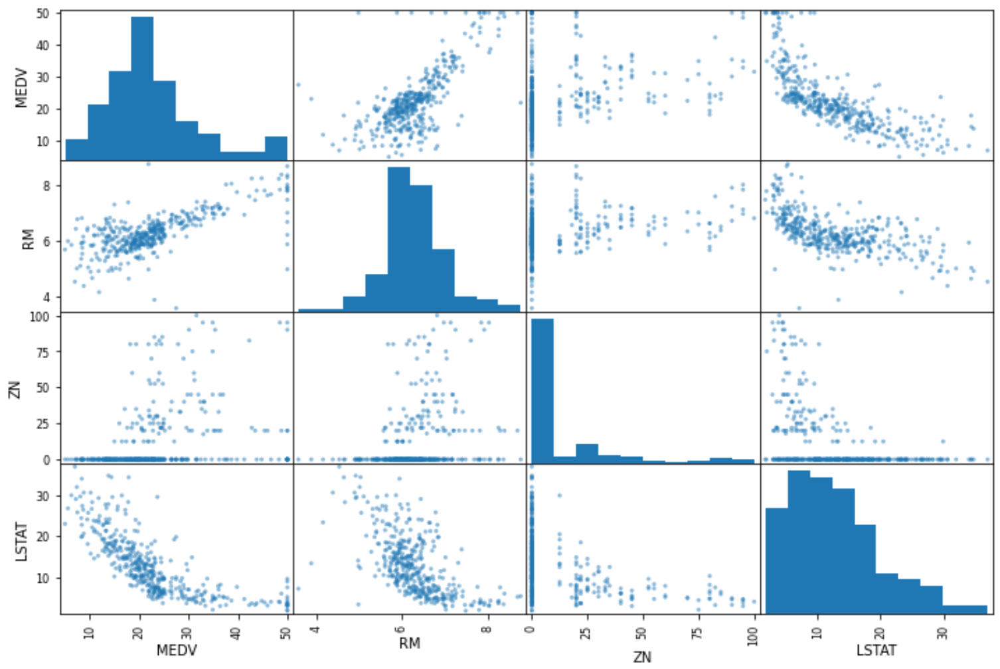

# House Price Prediction Using Machine Learning

This project uses machine learning techniques to predict housing prices in the Boston area. The dataset includes information on various factors such as crime rate, tax rate, number of rooms, and more. The project implements models like **Linear Regression**, **Decision Tree Regressor**, and **Random Forest Regressor**, with the **Random Forest** model providing the most accurate predictions.

## Table of Contents
1. [Project Overview](#project-overview)
2. [Dataset Information](#dataset-information)
3. [Project Structure](#project-structure)
4. [Requirements](#requirements)
5. [Installation](#installation)
6. [Feature Engineering](#feature-engineering)
7. [Model Training](#model-training)
8. [Model Evaluation](#model-evaluation)
9. [Usage](#usage)
10. [Results](#results)
11. [Contributors](#contributors)
12. [License](#license)

## Project Overview
This project explores various machine learning algorithms to predict the median house prices in suburban areas of Boston, Massachusetts. It involves preprocessing the dataset, feature engineering, and applying regression algorithms to evaluate the most accurate model.



## Dataset Information
- The dataset contains **506 entries** with **14 attributes**. These attributes include both numeric and categorical features. The target variable is **MEDV** (median value of owner-occupied homes).
- Dataset used: Boston Housing Dataset from UCI Repository.

### Main Features:
- **CRIM**: Crime rate per capita.
- **ZN**: Proportion of residential land zoned for lots over 25,000 sq. ft.
- **INDUS**: Proportion of non-retail business acres per town.
- **CHAS**: Charles River dummy variable (1 if tract bounds river; 0 otherwise).
- **NOX**: Nitric oxides concentration (parts per 10 million).
- **RM**: Average number of rooms per dwelling.
- **AGE**: Proportion of owner-occupied units built prior to 1940.
- **DIS**: Weighted distances to five Boston employment centers.
- **RAD**: Index of accessibility to radial highways.
- **TAX**: Full-value property tax rate per $10,000.
- **PTRATIO**: Pupil-teacher ratio by town.
- **B**: Proportion of Black residents.
- **LSTAT**: Percentage of lower status of the population.
- **MEDV**: Median value of owner-occupied homes in $1000s (target variable).



## Project Structure
```
|-- Dragon.joblib              # Trained Random Forest Model
|-- House Price Prediction.ipynb # Jupyter Notebook with complete project code
|-- Model Usage.ipynb           # Jupyter Notebook showing how to use the saved model
|-- data.csv                    # Dataset in CSV format
|-- housing.data                # Raw dataset in alternative format
|-- housing.names               # Dataset description file
|-- Outputs from different models # Model outputs and logs
|-- README.md                   # Readme file (this file)
```

## Requirements
This project requires the following Python libraries:
- `pandas`
- `numpy`
- `scikit-learn`
- `matplotlib`

Install the required libraries using the following command:
```bash
pip install -r requirements.txt
```

## Installation
1. Clone the repository:
   ```bash
   git clone https://github.com/yourusername/HousePricePredictor.git
   ```
2. Navigate to the project directory:
   ```bash
   cd HousePricePredictor
   ```
3. Install the required packages:
   ```bash
   pip install -r requirements.txt
   ```

## Feature Engineering
In this step, we prepare the data for the model:
- **Handling missing values**: We use the `SimpleImputer` to handle missing values in the dataset, replacing them with the median of the column.
- **Feature scaling**: We apply both **min-max scaling** and **standardization** to ensure features are on the same scale.


## Model Training
Three different models were trained:
1. **Linear Regression**
2. **Decision Tree Regressor**
3. **Random Forest Regressor**

## Correlations



The models were trained using the **training set** (80% of the data) and validated using **cross-validation** with 10 folds to avoid overfitting.

### Pipeline
A machine learning pipeline was created that:
- Handles missing values
- Standardizes the features
- Trains the model

## Model Evaluation
We evaluated the models using **Root Mean Squared Error (RMSE)**. The **Random Forest Regressor** gave the best results with the lowest RMSE.

| Model               | RMSE  |
|---------------------|-------|
| Linear Regression    | 4.93  |
| Decision Tree        | 3.68  |
| Random Forest        | 2.98  |

### Cross-validation Results:
- Random Forest RMSE mean: 3.30
- Cross-validation standard deviation: 0.62


## Usage
To use the trained model, load the `Dragon.joblib` file and pass the required features:
```python
from joblib import load
import numpy as np

model = load('Dragon.joblib')
features = np.array([[-6.43942006, 4.12628155, -1.6165014, -0.67288841, -1.42262747, 
                      -20.44443979304, -49.31238772,  7.61111401, -26.0016879, 
                      -0.5778192, -0.97491834,  0.41164221, -66.86091034]])

prediction = model.predict(features)
print(f"Predicted House Price: {prediction[0]}")
```

## Results
The **Random Forest Regressor** model achieved the lowest RMSE and provided accurate predictions for the test set.

### Example Prediction:
For the feature set:
```
[-6.43942006, 4.12628155, -1.6165014, -0.67288841, -1.42262747, 
 -20.44443979304, -49.31238772, 7.61111401, -26.0016879, -0.5778192, 
 -0.97491834, 0.41164221, -66.86091034]
```
The predicted price is **24.607** (in $1000s).

## Contributors
- **Siddhant Saini** - [LinkedIn](https://www.linkedin.com/in/siddhant-saini/)
- Manipal Institute of Technology

## License
This project is licensed under the MIT License.

---

In the README:
- Replace `path_to_image_X.png` with actual image paths for visuals such as dataset distributions, correlation heatmaps, and model comparison graphs.
- Include screenshots of charts like the scatter plot matrix, correlation heatmap, and model predictions output from your notebooks.

For images like **Model Training**, **Feature Engineering**, etc., you can use the ones you provided or generate visuals from your project code for added context.

Let me know if you need further modifications!
