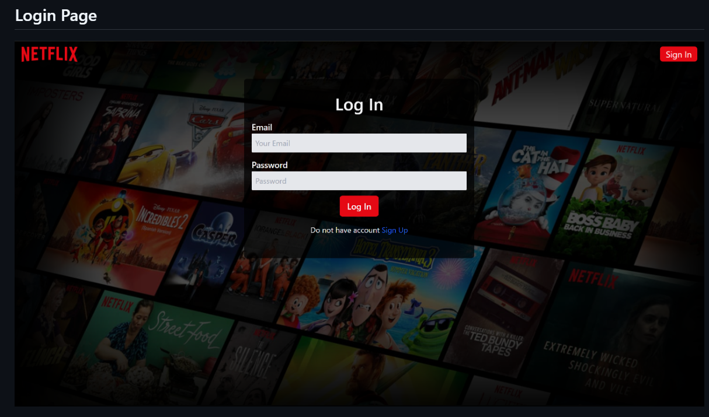
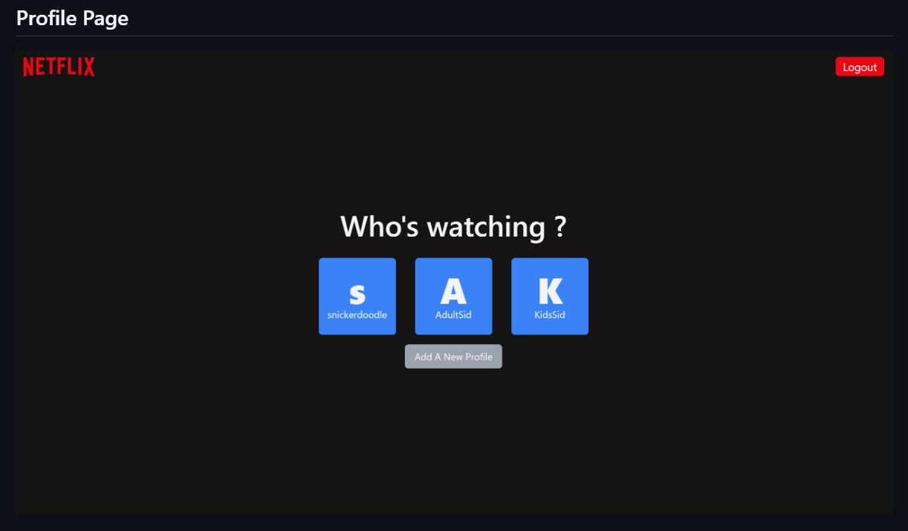
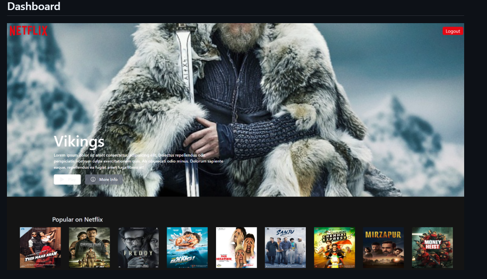

# Netflix-like Movie Streaming Website

A Netflix-like movie streaming website built using Django. This project includes login, profile management, and a dashboard for displaying movie content, along with a movie page.

## Table of Contents
- [Features](#features)
- [Screenshots](#screenshots)
- [Technologies Used](#technologies-used)
- [Setup Instructions](#setup-instructions)
- [Folder Structure](#folder-structure)

## Features
- User authentication (Login and Sign Up)
- Profile creation and selection
- Dashboard with popular movies
- Movie detail pages
- Responsive design

## Screenshots

### 1. **Login Page**

Users can log in using their credentials or sign up for a new account.

### 2. **Profile Selection Page**

Users can choose between different profiles or create a new one.

### 3. **Dashboard**

Displays a variety of popular movies available for streaming.

### 4. **Movie Detail Page**

Detailed view of a movie with an option to play the trailer.

## Technologies Used
- **Backend**: Django (Python)
- **Frontend**: HTML, CSS, Bootstrap
- **Database**: SQLite (Default Django database)
- **Static Files**: Managed using Django static files

## Setup Instructions

1. **Clone the repository**:
    ```bash
    git clone https://github.com/yourusername/netflix-movie-streaming-website.git
    cd netflix-movie-streaming-website
    ```

2. **Create a virtual environment**:
    ```bash
    python3 -m venv env
    source env/bin/activate  # For Windows: env\Scripts\activate
    ```

3. **Install the dependencies**:
    ```bash
    pip install -r requirements.txt
    ```

4. **Migrate the database**:
    ```bash
    python manage.py migrate
    ```

5. **Run the server**:
    ```bash
    python manage.py runserver
    ```

6. **Access the website**:
    Open your browser and go to `http://127.0.0.1:8000/`

## Folder Structure

```
netflixprj/
│
├── netflixapp/
│   ├── migrations/
│   ├── __pycache__/
│   ├── admin.py
│   ├── apps.py
│   ├── forms.py
│   ├── models.py
│   ├── tests.py
│   ├── urls.py
│   ├── views.py
│
├── static/
│   ├── assets/
│   │   ├── background_netflix.jpg
│   │   ├── chevron.svg
│   │   ├── mobile-0819.jpg
│   │   ├── netflix.png
│   │   ├── vikings.jpg
│   │   ├── style.css
│
├── templates/
│   ├── login.html
│   ├── dashboard.html
│   ├── profile.html
│   ├── movie_page.html
│
├── db.sqlite3
├── manage.py
└── README.md
```
